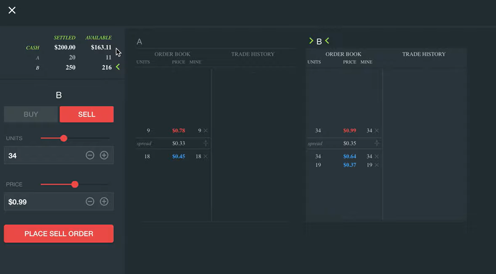
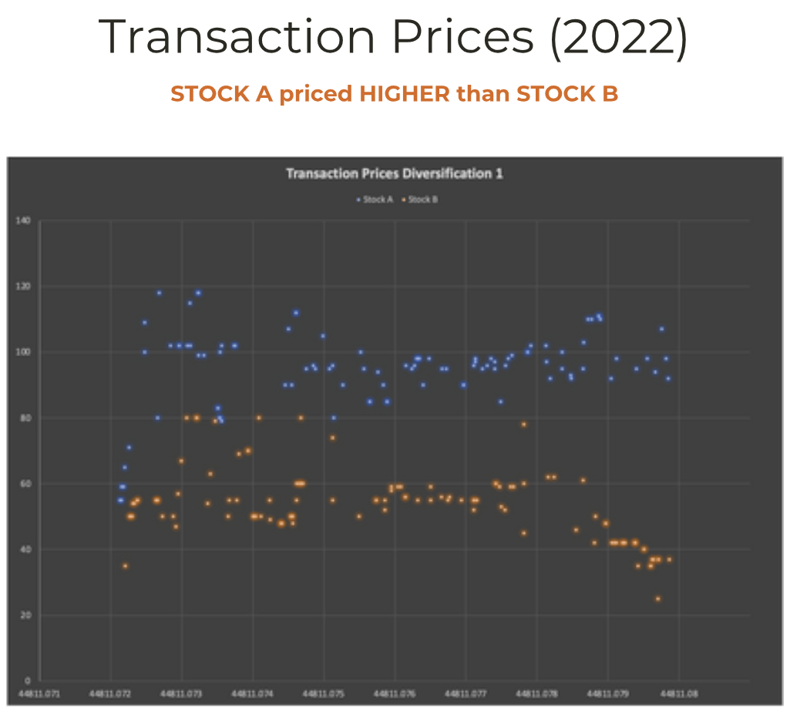

 
 

 
 

<h1>Flexemarkets Robots</h1>

    The Flexemarkets Robots repository comprises libraries and applications designed for the Flexemarkets platform, focusing on trading algorithms and automated bots.

    As a ULEEF member, I was responsible for designing and developing a variety of trading experiments, including environment setup, data aggregation, and result analysis.

<h2>Key Flexemarkets Applications:</h2>
<ul>
    <li>
        <strong>CAPM:</strong> Implements the Capital Asset Pricing Model to assess market equilibrium and risk-reward trade-offs.
    </li>
    <li>
        <strong>Credit Bubble:</strong> Simulates a multi-period market with public and private securities to explore credit bubble dynamics.
    </li>
    <li>
        <strong>Lucas Asset Pricing Model:</strong> Models a market with heterogeneous agents and variable private incomes, based on the Lucas framework.
    </li>
    <li>
        <strong>Markets:</strong> A single-period, multi-security market where participants earn payoffs based on security dividends.
    </li>
    <li>
        <strong>Smith Demand Supply Experiment:</strong> A single-session stock market experiment with distinct buyer and seller roles.
    </li>
    <li>
        <strong>SSW Experiment:</strong> The Smith, Suchanek, and Williams multi-period experiment focusing on stock dividends and trading strategies.
    </li>
    <li>
        <strong>Adverse Selection:</strong> A venture capital market simulation with entrepreneurs selling risky notes and venture capitalists investing for returns.
    </li>
    <li>
        <strong>Stock Exchange:</strong> A mock marketplace replicating real stock trading data for strategic analysis.
    </li>
</ul>

 
Source: <a href="https://github.com/adhocmarkets">Adhocmarkets GitHub</a>
