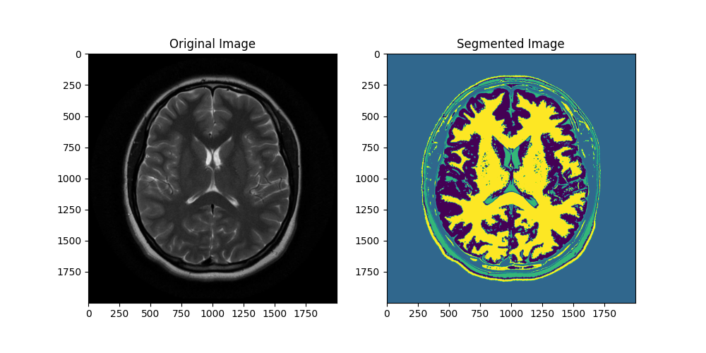

 
 

 
 

<h1>MRI Image Segmentation</h1>
  

    This Python script utilizes the KMeans clustering algorithm to perform color-based segmentation on MRI brain images. The goal is to identify dominant colors within the image, assisting in the visualization and analysis of different anatomical structures or abnormalities present in the MRI scans.
  

<h2>Results</h2>

    The script outputs the dominant colors found in the MRI image, providing a palette representing different tissue types or image features. The segmented image visually highlights the distinct regions identified through color clustering. The segmented images can be integrated into ML/DL for tasks such as image segmentation, classification, or object detection. The color clusters can serve as informative features, aiding neural networks in learning meaningful representations from the MRI data.

 
Source: <a href="https://github.com/DaniCoimbra/MRI-Image-Segmentation">MRI Github</a>
