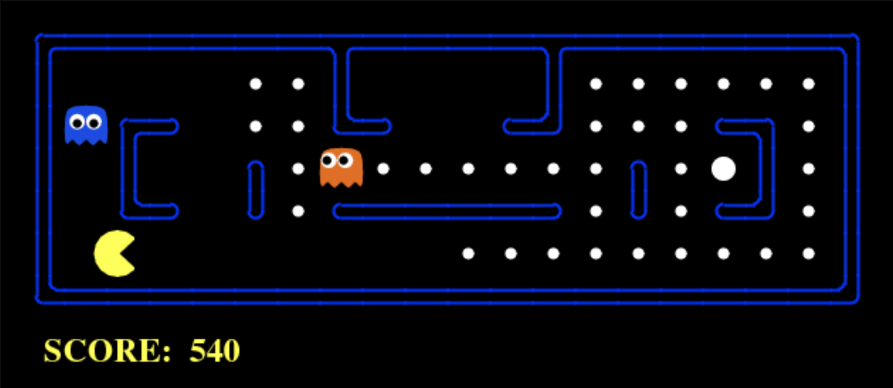

 
 

 
 

<h1>Pacman AI</h1>
  

    The Pacman AI project focuses on designing intelligent agents using a variety of search and learning algorithms. The project works on key aspects of AI development, including pathfinding, optimization, and decision-making in uncertain environments. Each algorithm is implemented to address specific challenges, building on difficulty and completeness of the actual game!
  

<h2>Project Overview</h2>

    Some of the algorithms developed include:

<ul>
  <li>
    <strong>Depth-First Search (DFS):</strong> Search by depth intensive, Explores all paths deeply before backtracking.
  </li>
  <li>
    <strong>Breadth-First Search (BFS):</strong> Explores closest nodes to find the shortest paths.
  </li>
  <li>
    <strong>Uniform-Cost Search (UCS):</strong> Finds the least costly path by expanding paths based on cost.
  </li>
  <li>
    <strong>A* Search:</strong> Uses heuristics to guide Pacman towards the goal, balancing the actual path cost and estimated distance using a approximation function of objective.
  </li>
  <li>
    <strong>Greedy Best-First Search:</strong> Uses heuristics to guide Pacman towards the goal without considering path cost.
  </li>
  <li>
    <strong>Heuristics Development:</strong> Custom heuristics enhance A* search, improving navigation in complex mazes.
  </li>
  <li>
    <strong>Multi-Agent Search:</strong> Strategies like Minimax and Alpha-Beta Pruning help Pacman compete against ghosts.
  </li>
  <li>
    <strong>Expectimax Search:</strong> Accounts for randomness in ghost movements, planning the best strategy under uncertainty.
  </li>
  <li>
    <strong>Monte Carlo Tree Search (MCTS):</strong> Simulates random playthroughs to explore possible moves and strategies.
  </li>
  <li>
    <strong>Q-Learning:</strong> A reinforcement learning algorithm allowing Pacman to learn optimal paths through exploration and exploitation.
  </li>
  <li>
    <strong>Approximate Q-Learning:</strong> Uses function approximation to handle large state spaces efficiently.
  </li>
  <li>
    <strong>Feature-Based Reinforcement Learning:</strong> Uses features of the state space to speed up learning and generalize across environments.
  </li>
</ul>
 
Source: <a href="https://github.com/DaniCoimbra/pacmanAI">PacmanAI Github</a>
