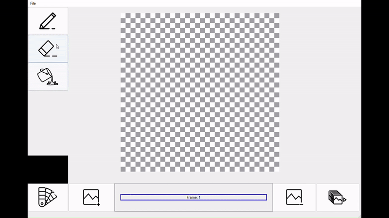
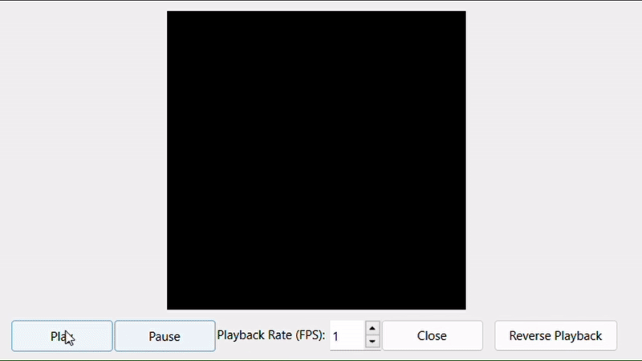

 
 

 
 

  <h1>Sprite Editor</h1>
  

    A simple sprite editor, built on Qt with C++. Using pixel bitmap, users can edit with pen, json save and load, and a couple of drawing options, such as color picker, fill bucket, eraser and more.
  

<h2>Gif Generation</h2>

  As another feature, users can merge their sprites into a gif, allowing for playback speed
  customization in fps, and for a playback reverse button. Finally, the software is capable of saving/loading a project, and adding new sprites to the existing project, that is possible with the use of JSON, storing the grid state by each pixel setting.

Source: <a href="https://github.com/DaniCoimbra/Sprite-Editor">Sprite Editor</a>
