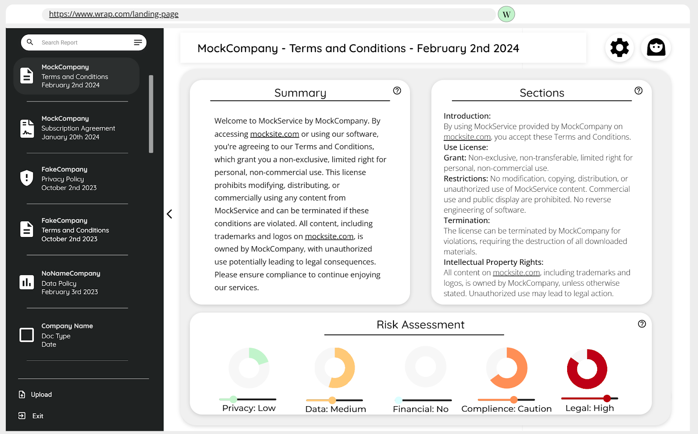

 
 

 
 

    <h1>Wrap</h1>
    
     

    <h3>Overview:</h3>
    
Wrap is an innovative tool that enhances how users interact with legal documents online, such as terms and conditions, contracts, and user agreements. It simplifies the understanding of these documents by providing automatic summaries, section labeling, risk assessments, and jargon explanations through a user-friendly interface that integrates seamlessly into everyday browsing.

    <h3>Features:</h3>
    <ul>
        <li><strong>Web Extension:</strong> Automatically detects and analyzes legal documents during browsing.</li>
        <li><strong>Report Generation:</strong> Provides summaries, risk assessments, and jargon definitions.</li>
        <li><strong>Document Library:</strong> Centralized access to saved and updated reports for ongoing reference.</li>
    </ul>

    <h3>Tech Stack:</h3>
    <ul>
        <li><strong>Frontend:</strong> Built with React for a dynamic and responsive user interface, complemented by HTML and CSS for structure and styling.</li>
        <li><strong>Backend:</strong> Node.js with Express handles server-side logic, REST APIs, and routing, while Flask supports microservices for NLP processing.</li>
        <li><strong>Database:</strong> MongoDB for managing user data, documents, and reports.</li>
        <li><strong>Web Extension:</strong> Uses Manifest V3 for structure and Trafilature for content extraction from web pages.</li>
        <li><strong>NLP:</strong> Hugging Face Transformers power the summarization, labeling, and risk assessment features.</li>
        <li><strong>Cloud & APIs:</strong> AWS EC2 for scalability and performance, with CORS middleware facilitating cross-domain interactions for seamless integration between frontend and backend.</li>
    </ul>

    <h3>Impact:</h3>
    
Wrap revolutionizes online legal document engagement, ensuring informed consent and enhancing legal safety with a robust tech-driven approach.

<strong>Source:</strong>
Not Open Source... Reach out for details! 
 
<!-- Source: <a href="https://github.com/theVacay/vacay">theVacay/vacay</a> -->
